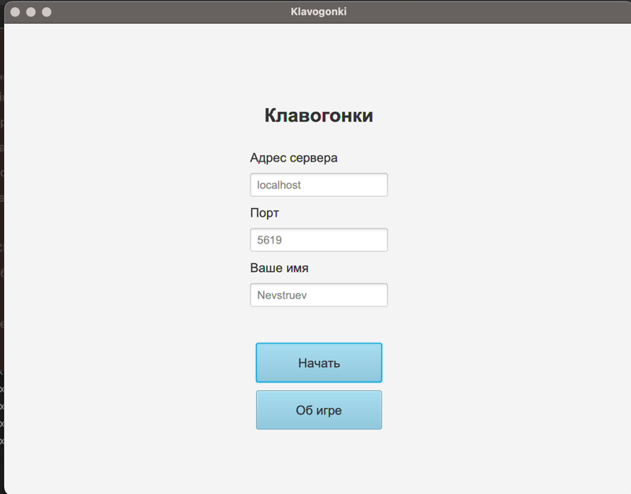
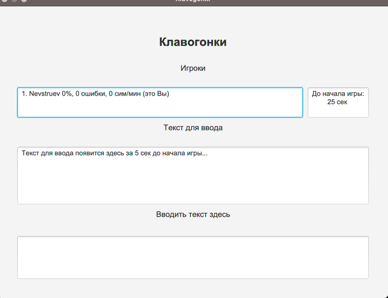
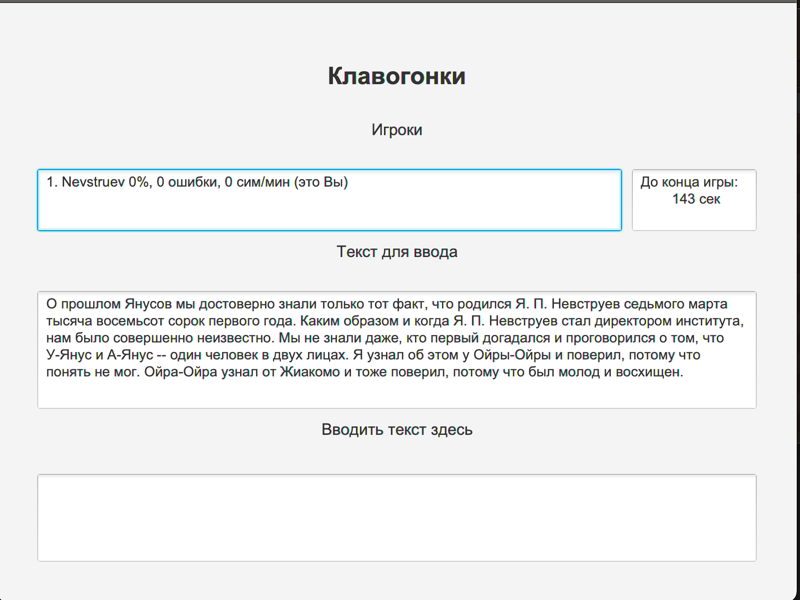
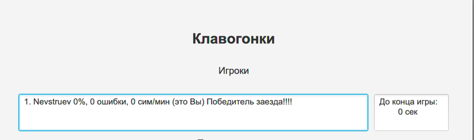

***
# KeyBoardRace

Клиент-серверное приложение имплеметирующее классическую игру клавагонки.

Картинки работы приложения:

(главный экран)

(экран начала игры)

(сама игра)

(вы победили)

## О самой реализации....

Многопоточный сервер где для каждой игры создается новый поток. 

### Клиент
Приложение, через которое игроки участвуют в клавогонках.

### Сервер
Сервер принимает входящие tcp-соединения с помощью ServerSocket
Сервер формирует группы для участия в гонке по 3 игрока. Если не удаётся набрать группу в течение 30 секунд, то группа состоит из стольких игроков, сколько подключились.
В ходе формирования группы сервер обновляет табличку с подключившимися игроками в игре.
Если игрок отключился, то там высвечивается сообщение что игрок потерял соединение то баллы не обнуляются и не обновляются. 

Транспорт соединения -- сокеты из стандартного пакета языка. (java.io.socket)
Каждый поток игры хранит в себе клиентские сокеты для общения. 

